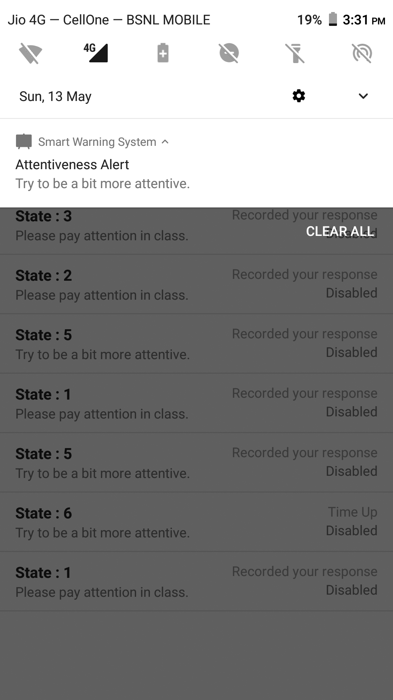
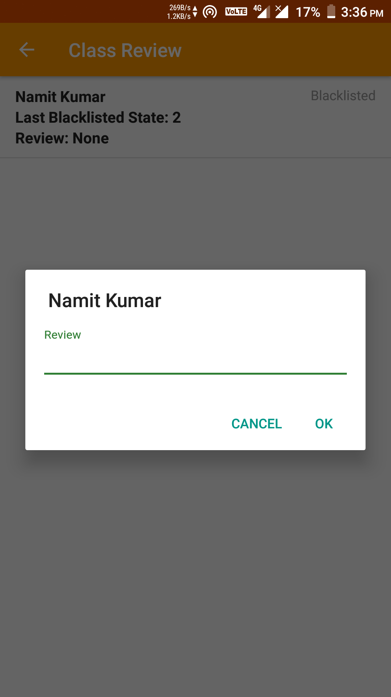

# Smart Warning System

A real-time automatic warning system for (unattentive) students in an ongoing lecture, each notification requiring a touchscreen-tap acknowledgement in a timed window. Full class report or specifically the blacklisted students are available to the teacher on demand.
This application was developed as a course project for CS242/243 Software Engineering, IIT Guwahati. Detailed documentation namely SRS, Design, Code Review and Testing are available in the "documentation" sub-directory.
 

## Getting Started

### Prerequisites

```sh
Android Studio
Google Account
node with npm
```

### Development setup

#### [Initialise Firebase Project using your Google Account](https://firebase.google.com/docs/android/setup)

#### Local Android Studio Project

1. git clone https://github.com/nitinkedia7/SmartWarningSystem.git
2. Open the cloned folder in Android Studio

#### Firebase Cloud Function

1. [Getting Started for Cloud Functions](https://firebase.google.com/docs/functions/get-started)
2. Use this [file](https://github.com/nitinkedia7/SmartWarningSystem/blob/master/index.js) as index.js
3. Re-deploy

## App Usage Instructions

See [here](https://github.com/nitinkedia7/SmartWarningSystem/blob/master/documentation/AppUsageInstructions.pdf) for detailed usage instructions for the installed app both for the Student and Professor.

## Authors

* **[Nitin Kedia](https://in.linkedin.com/in/nitinkedia7)**
* **[Namit Kumar](https://in.linkedin.com/in/namitkrarya)**
* **[Jatin Goyal](https://in.linkedin.com/in/jatingoyal412)**

## Contributing

1. Fork it (<https://github.com/yourname/yourproject/fork>)
2. Create your feature branch (`git checkout -b feature/fooBar`)
3. Commit your changes (`git commit -am 'Add some fooBar'`)
4. Push to the branch (`git push origin feature/fooBar`)
5. Create a new Pull Request